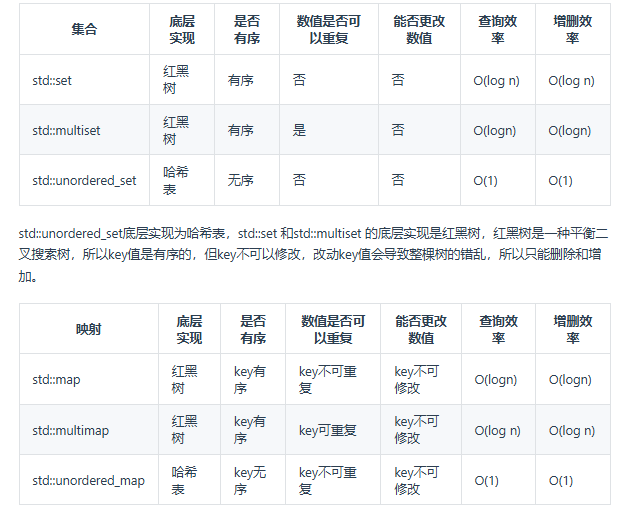

# 基础知识

* 计算如果超过哈希大小 对哈希大小取余 分配到不同的索引上

* 哈希碰撞 索引一样 ：拉链法：同一个索引上拉一个链表，线性探测法：tablesize要大于data 向下找一个空位放冲突的

* 常见的哈希结构(不是哈希表）：数组 set(集合) map（映射）

  

  

* std::unordered_map 底层实现为哈希表，std::map 和std::multimap 的底层实现是红黑树。同理，std::map 和std::multimap 的key也是有序的（这个问题也经常作为面试题，考察对语言容器底层的理解），红黑树是一种平衡二叉搜索树，所以key值是有序的，但key不可以修改，改动key值会导致整棵树的错乱，所以只能删除和增加。
* 追求效率用unorder 追求有序用set 既有序还要重复用multi
* 牺牲空间追求时间
* **如果需要判断一个元素是否出现过 第一反应用哈希！**

# 有效的字母异位词

## 思路

* 因为 字母只有26个 所以用数组是最方便的 只需要做一个映射
* 可以用s[i]-'a'表示他在当前数组的下标 比如a就是0 b就是1
* 因为`'a'` 的 ASCII 码是 **97**。`'b'` 是 98，`'c'` 是 99，依此类推，直到 `'z'` 是 **122**  他会自动切换到ascii码计算
* 所以可以计算每一个字母频率先++ 再-- 最后看是否全为0

## Tips

* key比较小的时候 能用数组用数组 比较快

## 题目

### 简单

\-[ X ] [242. 有效的字母异位词 - 力扣（LeetCode）](https://leetcode.cn/problems/valid-anagram/description/)

# 两个数组的交集

## 思路

## Tips

##  题目

### 